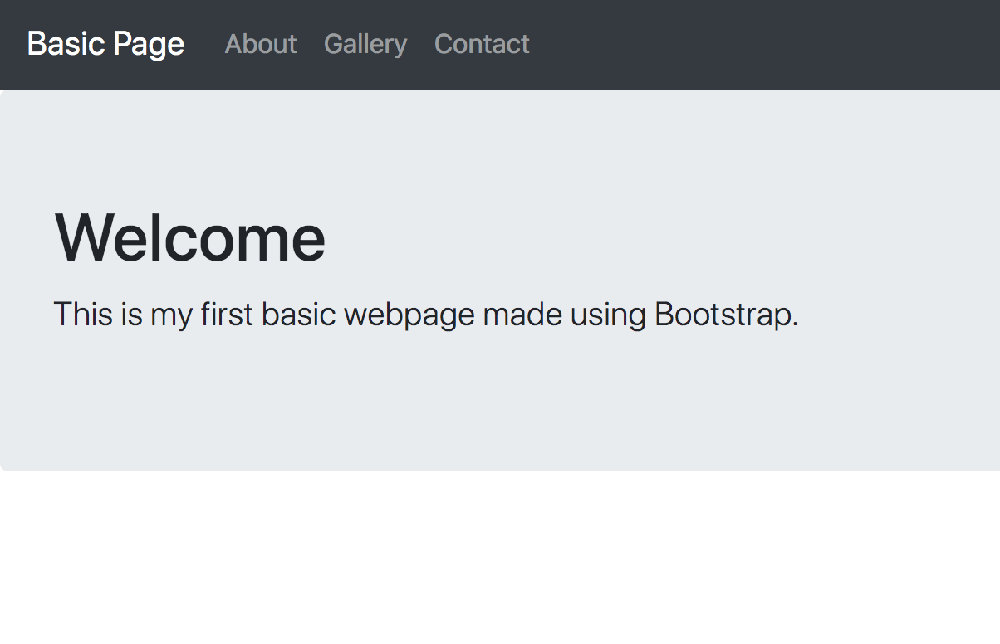

# Jumbotron Reference


## Code

```html
<!-- START: jumbotron -->
<div class="jumbotron">
	<h1>Welcome</h1>
	<p class="lead">This is my first basic webpage made using Bootstrap.</p>
</div>
<!-- END: jumbotron -->
```


# Image


