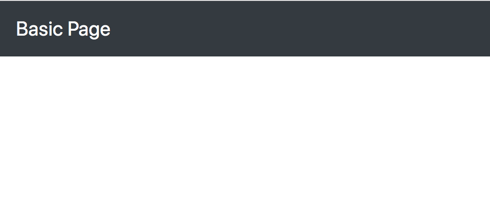

# Basic Webpage with Bootstrap

In this activity we will create a basic web page using the Bootstrap UI framework. In this git repository you are provided with a bare-bones homepage under `public/index.html` that is already setup to load Bootstrap. As with all activities we can start the web server by running the `npm start` command in the activities folder. When initially running this command the page should just be empty with a white background. As we work through the steps we'll be adding all the components required for a basic webpage.

Using Bootstrap heavily relies on referencing its documentation. It's not important to memorize how to use each of the components you're going to be introduced to throughout the course. Instead of memorizing how to use each component you're better off having a firm grasp of the fundamentals of HTML and CSS and know when and where in Bootstrap's documentation to look in order to implement its various components. In this exercise each component you will be told to implement will be accompanied by a link to the appropriate documentation at the **bottom** of each section.

***
- [Header](#header)
	- [Colour Schemes](#colour-schemes)
	- [Brand](#brand)
	- [Navigation](#navigation)
- [Jumbotron](#jumbotron)
	- [Responsive Image](#responsive-image)
- [Final Notes](#final-notes)
***


## Header

The first thing we're going to add is a header for this page. The Bootstrap component we will be using to implement one is called the _navbar_ component. Take a moment to read through the documentation's [how it works section](https://getbootstrap.com/docs/4.3/components/navbar/#how-it-works). Additionally use your browser's [element inspector](https://developers.google.com/web/tools/chrome-devtools/inspect-styles/) to reference the documentation's purple header. When using our element inspector to view the documentation's header we can see it uses Bootstrap itself and can use this as a reference for our own header.

We can see the documentation's header uses the `<header>` element. We could use a `<div>` and it would look the same on our monitors but the `<header>` element differs in that it provides semantical context to help describe the content of the page for users who may have accessability needs such as being visually impaired. Lets follow suit and add the `<header>` element to our own page right under the `<!-- START: header -->` comment.

```html
<!-- START: header -->
<header>

</header>
<!-- END: header -->
```

***&mdash; [Documentation](https://getbootstrap.com/docs/4.3/components/navbar/)***


### Colour Schemes

Reload your page and verify the `<header>` element is added to your page. It should be there but nothing has changed. We need to add some _classes_ to our `<header>` element. If we reference the documentation above there are a few code examples. Lets apply the classes from the first example into our code. Feel free to use any of the three listed examples but this activity will assume you applied the classes `navbar`, `navbar-dark`, and `bg-dark`.

| Class | Description |
| --- | --- |
| `navbar` | Indicates an element is the start of a _navbar_ component which is what we're using for our header. |
| `navbar-dark` | Changes the text colour within the navbar to something that's readable over a dark background. |
| `bg-dark` | Sets the background colour to a preset _dark_ colour. |

```html
<header class="navbar navbar-dark bg-dark">

</header>
```

If done correctly your page should look like this:


***&mdash; [Documentation](https://getbootstrap.com/docs/4.3/components/navbar/#color-schemes)***


### Brand

If we reload our page now we'll see there's a dark strip at the very top. It's so narrow because there's no content in it. Take a moment and read through the [supported content section](https://getbootstrap.com/docs/4.3/components/navbar/#supported-content) to get a rough overview of what kind of content we can add into our header.

We can start adding content by adding a _navbar brand_. If we use our element inspector and look at the documentation's header we can see the icon on the far left with a **B** with a box around it is the brand. The branding for our page will be the text _Basic Page_ instead of an image.

We can see the branding is an `<a>` element. This is usually done to link back to the home page. All the links in this activity won't be active but we'll make them links to emulate a real website. We'll give our `<a>` elements `href="#"` to do this.

```html
<a class="navbar-brand" href="#">Basic Page</a>
```

If done correctly your page should look like this:



***&mdash; [Documentation](https://getbootstrap.com/docs/4.3/components/navbar/#brand)***


### Navigation

For our basic webpage we will add a navigation bar in our header as well. To do this we need to implement the _nav_ component. We will implement the HTML to do so directly after our `<a>` element using a `<nav>` element to indicate a series of navigation links. Inside of it we will add an unordered list (`<ul>`) containing `<a>` elements for the following links:

- About
- Gallery
- Contact

If we write the HTML without applying any of Bootstrap's class names we should have an HTML structure that looks like this:

```html
<nav>
	<ul>
		<li>
			<a href="#">About</a>
		</li>
		<li>
			<a href="#">Gallery</a>
		</li>
		<li>
			<a href="#">Contact</a>
		</li>
	</ul>
</nav>
```

The result on our webpage will look rather unpleasant. We need to add the appropriate classes from Bootstrap into our HTML structure. Remember to reference the [documentation]((https://getbootstrap.com/docs/4.3/components/navbar/#nav)) to make things easier. The result should look something like this:

```html
<nav>
	<ul class="navbar-nav">
		<li class="nav-item">
			<a class="nav-link" href="#">About</a>
		</li>
		<li class="nav-item">
			<a class="nav-link" href="#">Gallery</a>
		</li>
		<li class="nav-item">
			<a class="nav-link" href="#">Contact</a>
		</li>
	</ul>
</nav>
```

You'll see we're not quite there yet. All the list items will be aligned to the right and be placed one on top of each other. We need to add the `navbar-expand` class to our header:

```html
<header class="navbar navbar-dark bg-dark navbar-expand">
```

If done correctly you should see a page that looks like this:


***&mdash; Documentation(https://getbootstrap.com/docs/4.3/components/navbar/#nav)***

The code in full should look like:

```html
<!-- START: header -->
<header class="navbar navbar-dark bg-dark navbar-expand">
	<a class="navbar-brand" href="#">Basic Page</a>
	<nav>
		<ul class="navbar-nav">
			<li class="nav-item">
				<a class="nav-link" href="#">About</a>
			</li>
			<li class="nav-item">
				<a class="nav-link" href="#">Gallery</a>
			</li>
			<li class="nav-item">
				<a class="nav-link" href="#">Contact</a>
			</li>
		</ul>
	</nav>
</header>
<!-- END: header -->
```


## Jumbotron

Bootstrap comes with a _jumbotron_ component show showcasing hero unit style content. In other words a large web banner that's often the first visual element encountered on some web pages. Take a moment to read the [documentation](https://getbootstrap.com/docs/4.3/components/jumbotron/) on it.

Now that we have some experience referencing Bootstrap's documentation from implementing our header, try implementing a jumbotron that meets the following criteria:

1. Contains a heading that reads: _Welcome_
1. Contains _lead_ text underneath it that reads: _This is my first basic webpage made using Bootstrap._

To check if you implemented this correctly check out [this reference](.readme-assets/jumbotron.md).

***&mdash; [Documentation](https://getbootstrap.com/docs/4.3/components/jumbotron/)***


### Responsive Image

We're going to add one last element into our jumbotron, an image. Add the following line of HTML to the end of your jumbotron's markup:

```html

```

We should see the image from the [Bootstrap doc's home page](https://getbootstrap.com/) directly under our lead text. If we resize the width of the browser you'll notice the image doesn't shrink alongside it and we can scroll through our page horizontally. Lets make this image responsive.

If we want to make an image responsive and we're unsure where in the documentation to look, we can use its search feature located on the top left of the page, under the header of the _Documentation_ section.


Start typing in _responsive_ into the search field. You should get a result listed with the text ***Images / Responsive images*** that will lead to [this page](https://getbootstrap.com/docs/4.3/content/images/#responsive-images):


Take a moment to read through the page we've found.

The class we want to use from this is the `img-fluid`. If we apply that to our `` element and try resizing our window the image will now shrink and grow along with the browser's window.

Try to now center the image. You can see the final result to check your work [here](.readme-assets/jumbotron-image.md).


## Final Notes

If anything in this activity (or future activities) is confusing, try completing the parts you're unsure of again and taking the time to read the documentation slowly and properly. As always feel free to ask for help on Discord.

Don't feel obligated to memorize how to implement something like a navbar component or even something as simple as a jumbotron. Even after years of experience highly skilled developers still constantly reference documentation, especially so with Bootstrap.

It's encouraged you play around after completion of the activity and experiment. It will go a long way to help support what you've learned.
